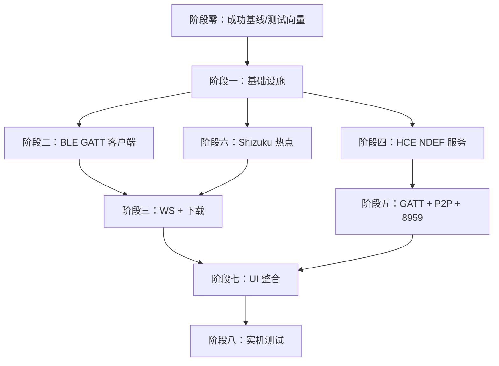

# HMTA NFC 一碰传移植计划

> 版本：2026-08-16
> 参考实现：NFCProbe（`F:\26973\MyProjects\NFCProbe`）— 双方向实机验证通过
> 权威协议依据：`docs/NFC-OPPO互传-完整移植文档.md`

---

## 0. 总览

将 NFCProbe 中已验证的 NFC 一碰传双方向链路移植到 HMTA，使 HMTA 在现有
BLE 互传联盟链路之外，新增与 OPPO 设备的 NFC 触碰触发文件传输能力。

| 方向 | 触发方式 | 华为角色 | NFCProbe 对应文件 |
|---|---|---|---|
| OPPO → 华为（接收） | NDEF URI + BLE 0x9999 + 热点 + WS | iOS 客户端 | `IosGattClient.kt` + `OshareWsClient.kt` |
| 华为 → OPPO（发送） | HCE NDEF + GATT 0x9955 + P2P + 8959 | 发送方 | `OppoNdefHceService.kt` + `OshareGattClient.kt` + `P2pProbeServer.kt` |

**关键约束**：
- OPPO 互传开关必须开启
- 华为加入 OPPO 热点需 Shizuku 提权（HMTA 已有 Shizuku 基础）
- HCE 卡模拟走鸿蒙 HOSP 通道
- 方向 B 必须使用 app/ptctouch 同品牌线路（iOS 线路在发送方向不可用）

### 0.1 移植原则

1. **先接收、后发送**：先交付 OPPO → 华为的接收 MVP，再做华为 → OPPO，
   避免同时调试两套独立状态机。
2. **协议原样，产品能力复用**：NFC/BLE/WS 的报文、加密和时序以 NFCProbe
   为准；文件落盘、通知、取消、任务互斥和 UI 状态复用 HMTA。
3. **不把 NFCProbeActivity 整体搬入 HMTA**：把 2513 行探针 Activity 拆成
   协议适配器、会话协调器和前台服务，避免把调试按钮与全局变量带入正式应用。
4. **门禁式推进**：每一阶段必须留存 HMTA 与 OPPO 双端日志，并通过该阶段的
   实机验收，才能进入下一阶段。

### 0.2 目标架构

```text
MainActivity / ShareActivity
          ↓
NfcTransferCoordinator（单会话、代际防抖、状态机、超时与清理）
     ┌────┴───────────┐
     ↓                ↓
OPPO→华为适配器       华为→OPPO适配器
NDEF+0x9999+WS        HCE+0x9955+8959
     └────┬───────────┘
          ↓
HMTA 共用层：文件源/落盘、通知、进度、取消、日志、Shizuku、P2P 生命周期
```

> 不直接让 NFC 代码调用 `P2pReceiverService` 的私有实现。应先从现有服务提取
> 可复用的 `IncomingArchiveSink`（MediaStore 落盘）和传输通知/进度接口；
> NFC 链路与互传联盟链路共用这些产品能力，但保留各自的网络协议适配器。

---

## 0A. 阶段零：冻结成功基线与测试向量

**目标**：在改 HMTA 前，把 NFCProbe 的“成功”变成可重复核验的基线。

- 记录两方向的实测设备、系统版本、OPPO 互传版本、操作步骤和成功日志；
- 保存脱敏后的 NDEF、0x9897/0x9896、0x9954/0x9953、WS 报文测试向量；
- 记录单文件、多文件和大文件的 SHA-256、耗时、热点清理结果；
- 在 HMTA 当前主线先跑一次编译、单元测试和现有双向互传冒烟测试，作为回归基线；
- 建立功能开关 `nfcTransferEnabled`，未通过完整验收前默认关闭正式入口。

**退出门禁**：两方向各至少一份完整成功会话证据；HMTA 原功能基线全部通过。

---

## 1. 阶段一：基础设施搭建

**目标**：Manifest 权限、NFC 资源文件、前台分发框架就绪。

### 1.1 Manifest 新增权限与组件

```xml
<!-- 新增权限 -->
<uses-feature android:name="android.hardware.nfc" android:required="false" />
<uses-permission android:name="android.permission.NFC" />
<uses-permission android:name="android.permission.ACCESS_NETWORK_STATE" />
```

```xml
<!-- MainActivity 新增 NDEF intent-filter -->
<!-- 同时将 MainActivity 设为 launchMode="singleTop"，确保进入 onNewIntent -->
<intent-filter>
    <action android:name="android.nfc.action.NDEF_DISCOVERED" />
    <category android:name="android.intent.category.DEFAULT" />
    <data android:scheme="https" android:host="connect.oppo.com" />
</intent-filter>
```

```xml
<!-- 方向 B：HCE NDEF 服务（app/ptctouch） -->
<service
    android:name=".services.NdefHceService"
    android:exported="true"
    android:permission="android.permission.BIND_NFC_SERVICE">
    <intent-filter>
        <action android:name="android.nfc.cardemulation.action.HOST_APDU_SERVICE" />
    </intent-filter>
    <meta-data
        android:name="android.nfc.cardemulation.aid_category"
        android:resource="@xml/ndef_aid_list" />
    <!-- 鸿蒙 HOSP 通道 -->
    <intent-filter>
        <action android:name="ohos.nfc.cardemulation.action.HOST_APDU_SERVICE" />
    </intent-filter>
    <meta-data
        android:name="other-aid"
        android:value="D2760000850101" />
</service>
```

### 1.2 资源文件

新建 `app/src/main/res/xml/ndef_aid_list.xml`：
```xml
<?xml version="1.0" encoding="utf-8"?>
<host-apdu-service xmlns:android="http://schemas.android.com/apk/res/android"
    android:description="@string/hmta_ndef_service"
    android:requireDeviceUnlock="false">
    <aid-group android:category="other"
               android:description="@string/hmta_ndef_group">
        <aid-filter android:name="D2760000850101" />
    </aid-group>
</host-apdu-service>
```

> **注意**：NDEF AID 仅注册为 `other` 类别，禁止注册 `payment`，
> 否则会触发 HCE 选择器循环弹窗。

### 1.3 前台 NFC 分发

在 `MainActivity` 中新增：
- `onResume` 注册 `enableForegroundDispatch`
- `onPause` 注销 `disableForegroundDispatch`
- `onNewIntent` 解析 NDEF Tag → 提取 `code` 和 `devId`
- 只接受 `https://connect.oppo.com/oshare/clips/seo`，校验 `code` 为 16 位十六进制；
  相同 code 在短时间内去重，禁止把任意网页 URI 带入 BLE 协商

**NFCProbe 参考**：`NfcProbeActivity.kt` 中的 `enableForegroundNfc()` /
`disableForegroundNfc()` / `parseNdefTag()` 逻辑。

### 1.4 新增文件清单

| 文件 | 说明 |
|---|---|
| `res/xml/ndef_aid_list.xml` | HCE AID 列表 |
| `strings.xml` | 新增 `hmta_ndef_service` / `hmta_ndef_group` 字符串 |
| `utils/nfc/NfcIntentParser.kt` | NDEF URI 白名单解析与去重 |
| `services/nfc/NfcTransferCoordinator.kt` | 单会话状态机、generation、超时、清理 |

**退出门禁**：HMTA 能稳定收到 OPPO NDEF 并提取正确 code/devId；前后台切换、
重复触碰和方向 B 自身触碰均不弹系统“打开方式”选择器。

---

## 2. 阶段二：方向 A — BLE GATT 客户端（OPPO → 华为接收）

**目标**：实现 iOS 兼容线路的 BLE 协商（0x9999 服务，ECDH + AES/CBC）。

### 2.1 新建文件

| 文件 | 来源 | 说明 |
|---|---|---|
| `services/nfc/IosGattClient.kt` | NFCProbe `IosGattClient.kt` (476行) | BLE GATT 0x9999 客户端 |
| `utils/NfcCrypto.kt` | 从 IosGattClient 提取 | ECDH 密钥协商 + AES/CBC 加解密 |

### 2.2 核心逻辑

```text
扫描 OPPO BLE 广播（0x3334 / 0x8181）
    → 连接 0x9999 服务 → 协商 MTU=512
    → 读 0x9897 band（须 OPPO 上滑后，state=0 才继续）
    → 写 0x9896 init（明文 JSON，version=10302）
    → 收 OPPO 通知（account_id / wlan 信息）
    → 写 0x9896 热点确认
    → 收加密热点凭据（ssid/psk/ip/port，AES/CBC 解密）
    → 写 0x9896 回写本机 IP/端口（触发 OPPO 启动 HTTP 服务器）
```

### 2.3 关键适配点

- **串行写队列**：0x9896 写入必须等上次 `onCharacteristicWrite` 回调后再发下一条
- **代际防抖**：多次触碰产生多个 GATT 实例，用 generation 让旧回调失效
- **band 读取时机**：OPPO 上滑后才读（否则 state=1 且 OPPO 自杀）
- **ECDH 密钥**：华为端生成 EC P-256 密钥对，ECDH 协商后取 Base64 前 16 字符作 AES 密钥
- **AES/CBC/PKCS5Padding**，IV = `"0102030405060708"`（ASCII）

### 2.4 与 HMTA 现有代码的整合

- 复用 HMTA 的权限检查和设备信息；扫描使用 NFC 专用扫描器，避免与
  `ShareActivity` 的互传联盟扫描互相停止
- 复用 `ShizukuUtils.kt` 的 Shizuku 连接（需扩展，见阶段六）
- 状态交给 `NfcTransferCoordinator`，不在 GATT 回调中直接操作 Activity
- GATT 客户端必须支持显式 `close()`、generation 失效和重复会话清理

**退出门禁**：连续 10 次触碰均能完成 NDEF → 扫描 → GATT 预连接；上滑后
完成热点凭据解密，未上滑时能明确超时并完全释放 GATT。

---

## 3. 阶段三：方向 A — WebSocket 客户端 + 流式下载

**目标**：实现 WS 协商、chunked 下载、ZIP 解压落盘的完整接收链路。

### 3.1 新建文件

| 文件 | 来源 | 说明 |
|---|---|---|
| `services/nfc/OshareWsClient.kt` | NFCProbe `OshareWsClient.kt` (598行) | WS 客户端 + 下载 |

### 3.2 WS 协议流程

```text
连接 ws://<ip>:<port>/websocket（明文优先，失败回退 TLS）
    ← action:0:versionNegotiation?{"versions":[1]}
    → ack:0:versionNegotiation?{"version":1}
    ← action:0:sendRequest?{"id","fileName","totalSize","mimeType",...}
    → ack:0:sendRequest
    → GET http://<ip>:<port>/download?taskId=<id>
    ← Transfer-Encoding: chunked + ZIP 流
    → 流式 ZipInputStream 逐文件解压落盘（MediaStore）
    → action:0:status?{"taskId":"<id>","type":1}
    ← ack:0:status?{"type":1}
    → 关闭 WS（触发 OPPO 收起热点）
```

### 3.3 关键适配点

- **明文 WS 优先**：OPPO 版本 >= 10015 用明文 WS，低版本用 WSS；先尝试明文
- **chunked 解码**：逐帧解析 chunked encoding，终止块即停
- **流式解压**：`ZipInputStream` 逐 entry 写盘，禁止整读内存
- **WS 超时**：读超时设 60s（下载期间无消息），不中断
- **status 必达**：下载完成后必须发 status(type=1)，收到 ack 后才关 WS
- **进度上报**：每 1MB 上报进度到 UI

### 3.4 落盘整合

- 从 `P2pReceiverService.saveArchive()` 提取共用 `IncomingArchiveSink`，复用
  MediaStore、重名处理、ZIP 路径校验和 `ReceivedFile` 模型
- 文件落盘到 `Download/HMTA/` 目录
- 复用 `NotificationUtils` 发布传输进度通知
- 下载前做可用空间预检；落盘失败或取消时删除未完成的 MediaStore 项

**退出门禁**：OPPO → 华为单文件完整落盘、双方显示成功、OPPO 热点自动收起；
随后通过 10 文件、100MB+、取消、断网和连续两轮传输测试。

---

## 4. 阶段四：方向 B — HCE NDEF 卡模拟服务（华为 → OPPO 发送）

**目标**：实现 NDEF HCE 服务，使 OPPO 触碰华为时自动读取 app/ptctouch NDEF
并进入接收状态。

### 4.1 新建文件

| 文件 | 来源 | 说明 |
|---|---|---|
| `services/nfc/NdefHceService.kt` | NFCProbe `OppoNdefHceService.kt` (257行) | NDEF HCE 卡模拟 |

### 4.2 NDEF 构造

```text
NDEF Message:
  Record: tnf=0x02 (MIME)
  type: "app/ptctouch"
  payload: 0x03 + 12字节随机IV + AES-GCM密文(NfcPublishData protobuf)

NfcPublishData protobuf 字段：
  1 deviceType=8（PAD）
  2 connectType=32
  3 btMacAddress=<华为真实蓝牙MAC>
  4 btEnabled=true
  5 wifiEnabled=true
  9 version=1
  17 topActivityPackageName=<HMTA包名>
  18 peerPTCVersion="16.35.0"
```

> NDEF 不携带 SSID/PSK/P2P 信息；这些信息在后续 0x9953 中传递。禁止把方向 A
> 的 URI NDEF 或自定义 JSON 混入同品牌线路。

### 4.3 APDU 处理

```text
SELECT AID D2760000850101 → 返回 9000
READ BINARY (offset, length) → 返回 NDEF 数据分页 + 9000
```

### 4.4 关键适配点

- **AES-GCM 加密**：使用 NFCProbe 已验证的固定 24 字节协议密钥（AES-192）、
  12 字节随机 IV 和 128-bit GCM tag；保留脱敏测试向量做单元测试
- **分页读取**：READ BINARY 按 offset/length 返回 NDEF 数据片段
- **SELECT 计数**：每次发送需新的 SELECT 事件（触碰门槛），避免免触碰直发
- **鸿蒙 HOSP**：Manifest 中 `ohos.nfc.cardemulation.action.HOST_APDU_SERVICE`
  + `other-aid` 元数据确保华为系统路由表注册

**退出门禁**：OPPO 无需打开 HMTA 配套页面即可读到 NDEF 并进入系统接收确认；
连续两轮发送都必须发生新的 SELECT，不能免触碰启动。

---

## 5. 阶段五：方向 B — GATT 客户端 + P2P 建组 + 8959 发送服务

**目标**：完成华为发送方向的完整链路（GATT 握手 + WiFi Direct + 文件发送）。

### 5.1 新建文件

| 文件 | 来源 | 说明 |
|---|---|---|
| `services/nfc/OshareGattClient.kt` | NFCProbe `OshareGattClient.kt` (548行) | 方向 B GATT 客户端 |
| `services/nfc/NfcP2pServer.kt` | NFCProbe `P2pProbeServer.kt` (557行) | 8959 WS 发送服务 |

### 5.2 GATT 客户端流程

```text
OPPO 读到 NDEF → 弹出接收确认 → 用户确认 → OPPO 启动 0x9955 GATT 服务
华为：
    → 扫描 OPPO BLE → 连接 0x9955
    → 读 0x9954（OPPO 设备信息 + P2P 凭据）
    → 写 0x9953（华为 P2P 凭据，ka.c.i 格式）
    → 断开 BLE → 等待 P2P 连接
```

### 5.3 8959 发送服务流程

```text
华为启动 8959 WS 服务器（TLS）
    → WiFi Direct 建组（GO）
    → OPPO 连接华为热点
    → OPPO WS 连接 8959
    ← action:0:versionNegotiation
    → ack:0:versionNegotiation
    → action:0:sendRequest（多文件元数据）
    ← ack:0:sendRequest
    ← GET /download?taskId=<id>
    → chunked ZIP 流式发送
    ← action:0:status?{"type":1}
    → ack:0:status → 关闭 WS → 拆除 P2P 组
```

### 5.4 与 HMTA 现有代码的整合

- 从 `P2pSenderService` 提取 P2P 建组/拆组和 `ContentResolver` 文件源能力；
  不复用其现有互传联盟报文状态机
- 第一版 8959 服务严格移植 NFCProbe 已验证的线路和 `wss.p12` 证书资源，
  先保证字节级行为一致；通过回归后再评估是否改为 Ktor 实现
- 抽取共用 `OutgoingFileSource`，让两种发送协议都流式读取 URI
- `NfcSendService` 作为前台服务持有 P2P、GATT、8959 和通知生命周期，
  `ShareActivity` 只提交文件并展示状态

### 5.5 关键适配点

- **0x9953 写入串行**：同 0x9896，等回调再写
- **P2P 建组**：华为作 GO（Group Owner），SSID/PSK 在 NDEF 中携带
- **多文件流式**：`ZipOutputStream` 逐文件写入 chunked 响应流
- **触碰门槛**：NDEF SELECT 计数对比，确保每次发送都有新的 NFC 触碰

**退出门禁**：华为 → OPPO 单文件成功且 P2P 组被拆除；随后通过多文件、
100MB+、OPPO 拒绝、用户取消、扫描超时和连续两轮发送。

---

## 6. 阶段六：Shizuku 热点增强

**目标**：扩展 Shizuku 能力，支持加入 OPPO 创建的外部热点。

### 6.1 HMTA 现有 Shizuku 能力

`ShizukuUtils.kt` + `MacAddressService.kt` 已实现：
- Shizuku 绑定/解绑
- 真实 MAC 地址读取
- UserService AIDL 调用

### 6.2 新增能力

| 功能 | 命令 | 说明 |
|---|---|---|
| 加入外部热点 | `cmd wifi connect-network <ssid> wpa2 <psk> -h` | 以 shell 身份加入 OPPO 热点 |
| 断开热点 | `cmd wifi disconnect-network` 或恢复原网络 | 传输完成后退出 OPPO 热点 |

### 6.3 新建/修改文件

| 文件 | 说明 |
|---|---|
| `utils/PrivilegedWifiController.kt`（新建） | 对上层暴露类型安全的加入/退出热点接口 |
| `services/MacAddressService.kt`（修改） | 在 shell UserService 内执行受限 WiFi 命令 |
| `IMacAddressService.aidl`（修改） | 增加受限命令接口，或增加 `execCommand()` 后仅由控制器调用 |

### 6.4 关键适配点

- **DHCP 等待**：加入热点后等待 DHCP 分配 IP（轮询 `ConnectivityManager`）
- **Network 绑定**：`Network.bindSocket()` 确保 WS 走热点网络而非蜂窝
- **网络恢复**：传输完成后断开热点，WiFi 自动回原网络
- **错误处理**：`addNetwork` 返回 -1 时降级到 Shizuku 命令
- **输入安全**：SSID/PSK 必须转义且不得由 UI 拼接任意 shell 命令

**退出门禁**：能在规定超时内加入 OPPO 热点、拿到 DHCP 地址并绑定 socket；
成功、失败、取消三条路径都能恢复原网络。

---

## 7. 阶段七：UI 与流程整合

**目标**：在 HMTA 现有 UI 中集成 NFC 一碰传入口与状态显示。

### 7.1 MainActivity 修改

```text
新增 NFC 状态检测（NFC 是否开启、HCE 服务是否注册）
新增 NDEF intent 处理（解析 connect.oppo.com URI → code/devId）
新增方向 A 触发入口（NDEF 解析后自动启动 BLE 协商）
新增方向 B 触发入口（选文件后启动 HCE + 8959 服务 + 等待触碰）
```

`MainActivity` 与 `ShareActivity` 只要处于前台都要启用 NFC foreground dispatch；
两者共用同一分发封装并交给 Coordinator 仲裁，避免自身读到的标签触发系统选择器
或启动第二个会话。

### 7.2 ShareActivity 修改

```text
系统分享面板选 HMTA 时，若检测到 NFC 可用：
    → 更新 HCE NDEF 会话数据 + 启动 8959 发送前台服务
    → 提示用户触碰 OPPO 设备
    → 触碰后自动触发方向 B 链路
```

### 7.3 UI 状态显示

| 状态 | 显示 |
|---|---|
| 等待 NFC 触碰 | "请将华为与 OPPO 设备靠近" |
| BLE 协商中 | "正在与 OPPO 设备协商连接..." |
| 加入热点中 | "正在连接 OPPO 热点..." |
| 传输中 | 进度条 + 文件名 + 速率 |
| 传输完成 | "已接收/发送 N 个文件" |
| 错误 | 具体错误信息 + 重试按钮 |

### 7.4 新增文件

| 文件 | 说明 |
|---|---|
| `ui/NfcStatusCard.kt` | NFC 状态卡片组件 |
| `utils/NfcUtils.kt` | NFC 工具类（前台分发、Tag 解析、状态检查） |

### 7.5 会话状态机

统一使用以下状态，UI、通知和日志只消费状态，不直接控制底层对象：

```text
Idle → WaitingForTap → BleNegotiating → PreparingNetwork
     → Transferring → Finalizing → Completed
任意运行态 → Cancelling/Failed → CleaningUp → Idle
```

任意终态必须执行同一清理流程：停止扫描、关闭 GATT/socket、停止 HCE 会话、
拆除 P2P 组、解绑 Network、清理临时文件并恢复原 WiFi。

---

## 8. 阶段八：实机测试与修复

### 8.1 测试用例

| 编号 | 场景 | 预期 |
|---|---|---|
| T1 | OPPO 相册选图 → NFC 触碰华为 → 华为接收 | 文件落盘 Download/HMTA |
| T2 | 华为选文件 → NFC 触碰 OPPO → OPPO 接收 | OPPO 显示接收成功 |
| T3 | 大文件（>100MB）接收 | 流式传输不 OOM |
| T4 | 多文件（>10 个）收发 | 所有文件完整 |
| T5 | 传输中取消 | 双方正确清理 |
| T6 | 连续多次触碰 | 无免触碰直发 |
| T7 | OPPO 未开互传开关 | 优雅提示而非崩溃 |
| T8 | Shizuku 未激活 | 提示需要 Shizuku |
| T9 | OPPO 拒绝/取消 | HMTA 立即停止并清理网络 |
| T10 | HMTA 传输中被系统回收 Activity | 前台服务保持或明确失败清理 |
| T11 | 文件名重复/恶意 ZIP 路径 | 重命名或拒绝，不能越界写入 |
| T12 | 连续双向切换 | 无旧 GATT/P2P/热点状态串线 |

### 8.2 回归测试

确保 NFC 移植不影响现有功能：
- 互传联盟 BLE 发现 + WiFi Direct 传输正常
- 系统分享面板发送正常
- 后台接收（TileService）正常

### 8.3 发布门禁

- 两方向各连续成功 10 次，成功率不低于 95%；
- 单文件、多文件、100MB+ 文件 SHA-256 一致；
- 取消、拒绝、超时、断网后 10 秒内完成资源清理；
- HMTA 现有互传联盟回归全部通过；
- Release 混淆包实机通过，功能开关才默认开启。

---

## 9. 文件映射总表

| NFCProbe 源文件 | 行数 | HMTA 目标文件 | 移植方式 |
|---|---|---|---|
| `IosGattClient.kt` | 476 | `services/nfc/IosGattClient.kt` | 适配重构 |
| `OshareWsClient.kt` | 598 | `services/nfc/OshareWsClient.kt` | 适配重构 |
| `OppoNdefHceService.kt` | 257 | `services/nfc/NdefHceService.kt` | 协议核心移植 + HMTA 状态适配 |
| `OshareGattClient.kt` | 548 | `services/nfc/OshareGattClient.kt` | 适配重构 |
| `P2pProbeServer.kt` | 557 | `services/nfc/NfcP2pServer.kt` | 适配重构 |
| `assets/wss.p12` | — | `assets/wss.p12` | 复制已验证的 8959 TLS 证书资源 |
| `ShizukuMacHelper.kt` | 177 | 合入 `services/HotspotService.kt` | 提取+扩展 |
| `ShizukuMacService.kt` | 187 | 合入 `MacAddressService.kt` | 扩展接口 |
| `NfcProbeActivity.kt` | 2513 | 拆分到 `MainActivity` + `NfcUtils` + 各服务 | 拆分整合 |
| `OppoHceService.kt` | 106 | 不移植（方向 B 不需要独立 HCE 服务） | 跳过 |
| `OshareGattServer.kt` | 488 | 不移植（HMTA 已有 GattServerService） | 跳过 |
| `OshareRfcommServer.kt` | 117 | 不移植（调试用，非核心链路） | 跳过 |

> `NfcProbeActivity.kt` 只作为编排参考，不复制 UI 和全局状态；成功链路中的常量、
> 超时、重试和清理语义必须进入对应组件及测试。

---

## 10. 技术风险与缓解

| 风险 | 影响 | 缓解措施 |
|---|---|---|
| HCE 在华为系统被过滤 | 方向 B 不可用 | HOSP 通道 + other-aid 元数据（NFCProbe 已验证） |
| 前台分发与系统 NFC 冲突 | 弹"打开方式"选择器 | onResume/onPause 严格管理前台分发 |
| Shizuku 未激活 | 无法加入 OPPO 热点 | UI 提前检测并提示激活 |
| OPPO 互传开关未开启 | NFC 触碰无反应 | 文档说明 + 错误提示 |
| 大文件 OOM | 传输失败 | 全链路流式（chunked + ZipInputStream） |
| 多次触碰状态残留 | 免触碰直发 | SELECT 计数触碰门槛 |
| WS 超时误断 | OPPO 发送失败 | 超时 60s + 下载期间继续等待 |
| 热点不自动关闭 | OPPO 热点常驻 | status ack 后主动关 WS |

---

## 11. 依赖关系图



**并行开发建议**：
- 主线按阶段零 → 一 → 二 → 三先交付接收 MVP；
- 接收 MVP 通过后再做阶段四 → 五，降低双状态机并行调试成本；
- 阶段六的 Shizuku 共用能力可与阶段二同步，但必须先于阶段三实机闭环；
- UI 只在底层状态机稳定后接入，避免用页面生命周期承载传输会话。

---

## 12. 建议交付批次

| 批次 | 范围 | 可演示结果 |
|---|---|---|
| PR 1 | 阶段零/一：测试向量、Manifest、NDEF 解析、协调器骨架 | HMTA 可稳定识别 OPPO 触碰 |
| PR 2 | 阶段二/六：0x9999 + Shizuku 热点 + 网络绑定 | 可拿到热点凭据并建立 LAN 连接 |
| PR 3 | 阶段三：WS 下载、落盘、通知、取消 | OPPO → 华为接收 MVP 完整闭环 |
| PR 4 | 阶段四：HCE app/ptctouch + 触碰门槛 | OPPO 自动进入接收确认 |
| PR 5 | 阶段五：0x9955 + P2P + 8959 | 华为 → OPPO 发送 MVP 完整闭环 |
| PR 6 | 阶段七/八：UI、异常矩阵、回归、Release 验证 | 双向功能可发布 |

每个 PR 都应可独立编译，新增协议解析/加密/ZIP 安全单元测试，并附对应实机日志。
