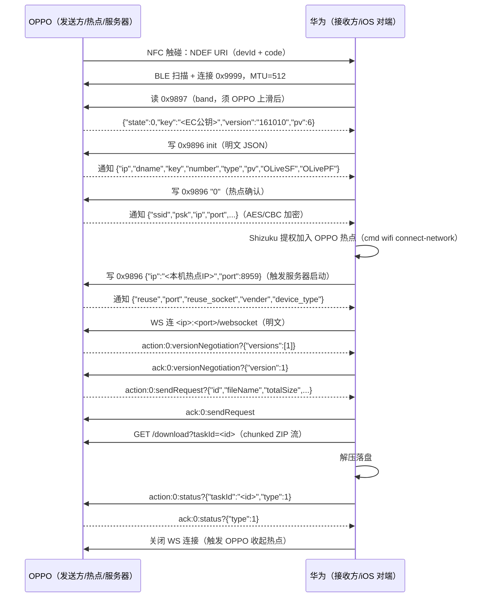

# OPPO → 华为 接收链路实现文档（iOS 兼容线路）

> 版本：2026-08-14 · 状态：实机验证通过（文件完整落盘、OPPO 显示发送成功、热点自动收起）
> 适用范围：HMTA 在华为（HarmonyOS/EMUI Android 兼容层）上接收 OPPO/一加设备经
> NFC 一碰传发送的文件。
> 参考实现：NFCProbe（`F:\26973\MyProjects\NFCProbe`），本链路在 NFCProbe 中
> 已完整跑通，本文档作为 HMTA 移植的独立实现依据。

---

## 1. 链路总览

华为端复用 **OPPO 的 iOS 兼容线路**（OPPO 相册分享触碰时对非 OPPO 设备走
`IosHostApduService`，即 NDEF + BLE GATT `0x9999` + 热点 + HTTP/WS 的形态），
华为作为「iOS 对端」完成接收。同品牌线路（`F000004F` HCE）因华为 NFC 芯片
场特征（`AB…0C0400 500057CD`）无法匹配 OPPO 期望（`…0C0400 65000000`）而
不可用，已放弃。



---

## 2. 前置条件

### 华为端
- HarmonyOS/EMUI（Android 兼容层，实测 EMUI 14.2 / Android 12 基准）；
- NFC、蓝牙、WiFi、定位（BLE 扫描需要）全部开启；
- **Shizuku 已激活**（`moe.shizuku.privileged.api`，无线调试或 adb 激活），
  且 NFCProbe/HMTA 已授权（shell uid=2000）；
- 第三方应用 `WifiManager.addNetwork()` 在 EMUI 被拒（返回 -1），加入 OPPO
  热点必须经 Shizuku 执行系统命令（见第 6 节）。

### OPPO 端
- 开启 NFC、蓝牙、WiFi，保持解锁、不关屏；
- 图库/文件分享面板 → OPPO 互传 → 触碰华为 → 上滑确认。

---

## 3. NFC 交换（NDEF）

OPPO 触碰时以 NDEF 卡模拟发布：

```text
AID: D2760000850101（NDEF）
记录: NdefRecord tnf=1 type='U'
payload: connect.oppo.com/oshare/clips/seo?version=1
         &devId=41EEF98C1656&code=<16位hex>&devType=3&devName=<设备名>
```

华为需提取：
- `devId`：OPPO 设备标识（记录用；热点 PSK 取前 8 位）；
- `code`：**random_code**，BLE init 的 `rdcode` 字段必须回传，OPPO 校验其
  是否在本次 NFC 随机码表内。

华为端通过前台 NFC 分发（`NDEF_DISCOVERED`，host=`connect.oppo.com`）拦截。

---

## 4. BLE GATT 服务（0x9999）

| 特征 | UUID | 方向 | 用途 |
|---|---|---|---|
| 0x9897 | `00009897-...` | 读 | iOS band：OPPO 返回状态 + EC 公钥 |
| 0x9896 | `00009896-...` | 写 | iOS 命令（init/account/wlan/ip-port） |
| 0x9898 | `00009898-...` | 通知 | 服务器 → 客户端消息 |
| 0x9895 | `00009895-...` | 通知 | 备用/预览（props=NOTIFY） |

服务 UUID：`00009999-0000-1000-8000-00805f9b34fb`。协商用 MTU=512。

### 4.1 加密（lb/a0.java）

```text
密钥派生: ECDH(本端 EC P-256 私钥, OPPO 公钥)
          -> KeyAgreement.getInstance("ECDH").generateSecret("TlsPremasterSecret")
AES 密钥: Base64(共享密钥字节) 的前 16 个字符，不足补 '0'
算法:     AES/CBC/PKCS5Padding，IV = "0102030405060708"（ASCII 8 字节）
密文:     Base64(加密(明文))
```

注意：**iOS 线路用 AES/CBC + Base64 截断密钥**；与同品牌线路的
AES/CTR + 原始密钥（0x9953）完全不同。

### 4.2 状态机（OPPO 侧 d8/v.java）

#### N=1（band 后）
华为读 0x9897，OPPO 返回：

```json
{"state":0,"key":"<OPPO EC 公钥 b64>","version":"161010","pv":6}
```

`state=0` 才继续；`state=1` 表示 OPPO 尚未就绪（未上滑），且 OPPO 会
`stopNfcService` 自杀。**必须在 OPPO 用户上滑确认发送之后再读 band**。

华为写 0x9896 init（version>=10302 明文）：

```json
{
  "key": "<华为 EC 公钥 b64>",
  "isFast": false,
  "version": "10302",
  "pv": 6,
  "type": "file/*",
  "number": 1,
  "dname": "HUAWEI Mate",
  "rdcode": "<NDEF code>"
}
```

#### N=6（账号校验）
OPPO 通知 `{"account_id":enc}`。华为回写 `{"account_id":<enc>}`；华为无 OPPO
账号时校验不匹配 → OPPO 弹接收确认卡片，用户确认后继续。

#### N=3（热点）
OPPO 通知：

```json
{"ip":enc,"dname":"霍倾城_","key":"<公钥>","number":"1","type":"image/*",
 "pv":6,"OLiveSF":true,"OLivePF":true}
```

华为写 `0`（热点确认）→ OPPO 建热点并通知（全部 AES/CBC 加密）：

```json
{"ssid":enc,"psk":enc,"ip":enc,"port":enc,"isFast":0,
 "vender":"OnePlus","device_type":"0"}
```

实测解密样例：`ssid=OnePlus Ace 6T Ge...@OShare41`、`psk=41EEF98C`、
`ip=10.215.43.110`、`port=<每次随机的动态端口>`。

#### N=3 → N=4（关键：回写 ip/port）
**OPPO 只有在收到客户端回写的含 `"ip"` 的 JSON 后，才会移除 20 秒定时器并
启动 HTTP 服务器**（`d8/v.java q() → l()`）。华为加入热点并拿到本机 IP 后，
立即写 0x9896（明文）：

```json
{"ip":"<本机热点IP>","port":8959}
```

OPPO 随即通知（服务器已启动）：

```json
{"reuse":enc,"port":enc,"reuse_socket":enc,"vender":"OnePlus","device_type":"0"}
```

> 实测教训：不回写 ip/port 时 OPPO 一直停在「对方正在连接你的热点」直到超时，
> HTTP 服务器根本不监听，WSS 连不上。

---

## 5. WebSocket 协商与文件传输

### 5.1 传输方式（TLS 判定，b9/c.java + b9/e.java）

OPPO iOSNettyServer 按**对端协议版本**决定是否启用 TLS：

```java
boolean z10 = (task == null || task.version() < 10015);  // z10=true → 加 SslHandler
```

- 对端版本 ≥ 10015（我们上报 `version=10302`）→ **明文 HTTP/WS**；
- 对端版本 < 10015 或任务为空 → WSS（TLS）。

华为端必须**先试明文 WS，失败再回退 TLS**（实测明文成功）。

### 5.2 信封格式

```text
<action>:<type>:<name>?<json>
action ∈ {action, ack}，type = 0，name ∈ {versionNegotiation, sendRequest, status, ...}
```

服务器 → 客户端：

```text
action:0:versionNegotiation?{"versions":[1]}
action:0:sendRequest?{"id":"<taskId>","senderId":"...","senderName":"...",
                      "fileName":"HPjM8m6a4AApEth.jpg","mimeType":"image/*",
                      "fileCount":1,"totalSize":439773,
                      "thumbnail_height":0,"thumbnail_width":0}
```

客户端应答：

```text
ack:0:versionNegotiation?{"version":1}
ack:0:sendRequest
```

### 5.3 下载（pa/a.java、c9/a.java、d9/a.java）

ack `sendRequest` 后**直接**请求（不要等待任何 `files` 消息——iOS 线路没有
独立的 files WS 消息）：

```text
GET http://<ip>:<port>/download?taskId=<sendRequest.id>
```

服务器响应：

```text
HTTP/1.1 200 OK
Transfer-Encoding: chunked          ← 关键：chunked + keep-alive，无 Content-Length
Content-Type: application/zip
Content-Disposition: attachment; filename="files.zip"
```

要点：
- 响应为 **chunked + keep-alive**：流完**不关闭连接**。接收方必须解析
  chunked 分帧，在读到终止块（`0\r\n\r\n`）后停止，不能等 EOF（否则 30 秒
  读超时；历史上曾因本地 WS 断连才碰巧读到 EOF）。
- body 是标准 ZIP：直接 `ZipInputStream` 按 entry 落盘。
- 下载期间 OPPO 不在 WS 上发消息，接收方 WS 读超时需足够长（建议 60 秒），
  否则连接被本地掐断、status 送不到。

### 5.4 完成（j9/l.java K()/L()/O()）

落盘后发送：

```text
action:0:status?{"taskId":"<sendRequest.id>","type":1}
```

服务器确认（成功路径）：

```text
ack:0:status?{"type":1}
```

### 5.5 关闭（热点自动收起的关键）

**OPPO 收到 status(type=1) 并回 ack 后，要等接收方关闭 WS 连接**
（服务端 `channelInactive → 消息 103 → stopFileServer → restore sap`）才收起
热点。接收方必须：

1. 收到 `ack:0:status` 后 500ms 主动关闭 WS；
2. 兜底：发完 status 后 2.5 秒无论是否收到 ack 都关闭连接。

> 实测教训：接收方一直保持 WS 连接时，OPPO 热点一直开着（断开后约 1 分钟才
> 自行清理）。主动关闭后热点立即收起、华为 WiFi 自动回原网络。

---

## 6. 热点加入（Shizuku 提权）

### 6.1 为什么必须提权

EMUI 14.2 限制第三方应用 `WifiManager.addNetwork()`（返回 -1）。官方替代
`WifiNetworkSpecifier` 需要用户弹窗确认且华为端有连上即断的已知问题；鸿蒙
原生 `ohos.wifiManager.addCandidateConfig` 仅限鸿蒙原生应用。对 Android APK，
静默加入热点唯一可行路径是 shell 提权。

### 6.2 系统命令

```bash
cmd wifi connect-network "<ssid>" wpa2 "<psk>" -m -h
```

- `-h`：标记隐藏网络，**命令立即返回**（不带 `-h` 会先等一轮扫描，最长可
  阻塞到 OPPO 超时）；
- 实测返回 `Connection initiated` 且 exit=0；
- 通过 Shizuku UserService（shell uid=2000）执行。

### 6.3 网络绑定

华为端若同时开着蜂窝，应用默认网络可能是蜂窝，热点 LAN 地址
（`10.215.43.x`）会 `ENETUNREACH`。修复：

1. 等 DHCP 就绪（`WifiManager.connectionInfo.ipAddress` / `dhcpInfo` 非 0）；
2. 用 `ConnectivityManager.getAllNetworks()` 过滤 `TRANSPORT_WIFI` 得到
   `Network` 对象；
3. 对 WS / 下载套接字调用 `Network.bindSocket(socket)`，强制走热点。

---

## 7. 华为端参考实现（NFCProbe）

以下为 NFCProbe 中已跑通的实现，HMTA 移植时可直接对照：

| 文件 | 职责 |
|---|---|
| `IosGattClient.kt` | BLE 客户端：连 0x9999、读 0x9897、写 0x9896、订阅 0x9898；EC 密钥对 + ECDH + AES/CBC；0x9896 串行写队列（等上一次写回调再发下一次）；`sendIpPort()` 回写本机 IP/端口 |
| `OshareWsClient.kt` | WS 客户端：明文 WS 优先 + TLS 回退；信封解析；sendRequest 后直接 `GET /download`；chunked 解码（终止块即停）；ZIP 解压落盘；status(type=1)；收到 ack 后主动关 WS |
| `NfcProbeActivity.kt` | 主流程：NDEF 解析、BLE 预连接、手动读 band、Shizuku 连热点、DHCP 等待、网络绑定、启动 WSS |
| `ShizukuMacHelper.kt` / `ShizukuMacService.kt` | Shizuku 权限/UserService 封装；`execCommand()` 以 shell 身份执行 `cmd wifi ...`；真实 MAC 读取 |

### 7.1 关键实现细节

- **0x9896 写入必须串行**：Android GATT 等上一次 `onCharacteristicWrite`
  回调后再发下一条，否则写入被栈丢弃（OPPO 收不到导致 ACK_TIMEOUT）。
- **读 band 时机**：BLE 预连接（MTU 协商完成）后保持连接，等用户上滑，再
  手动触发读 band（bandReadDelayMs≈2s）。
- **代际防抖**：多次触碰会产生多个 GATT 实例，用握手代际（generation）让
  旧实例的回调失效；相同 NDEF code 防抖。
- **WSS 重试**：连接失败最多重试 3 次，每次重连需重置 `closed` 状态。
- **日志**：页面只显示步骤/结果，完整日志存档到
  `/sdcard/Android/data/<pkg>/files/logs/`。

---

## 8. 操作流程（实机）

```text
1. 华为：打开 NFCProbe/HMTA 接收链，确认 Shizuku 已连接（uid=2000）；
2. OPPO：图库选图 → 分享 → OPPO 互传 → 停在设备选择页；
3. 两机 NFC 区域靠近（1~2 秒）；
4. 华为：读到 NDEF → 自动 BLE 预连接（保持）；
5. OPPO：弹分享卡片 → 上滑确认发送；
6. 华为：点【开始 iOS 协商】（读 band → init → 账号 → 热点确认）；
7. 华为：自动 Shizuku 加入 OPPO 热点 → 回写 ip/port → WS → 下载 → 落盘；
8. OPPO：显示发送成功 → 热点自动收起；华为 WiFi 自动回原网络。
```

文件落盘：`/sdcard/Android/data/<pkg>/files/received/<fileName>`。

---

## 9. 故障排查表（实测问题与修复）

| 现象 | 根因 | 修复 |
|---|---|---|
| band 返回 state=1，OPPO 自杀 | band 在 OPPO 上滑前读取 | 上滑后再读 band |
| `addNetwork` 返回 -1 | EMUI 限制第三方 addNetwork | Shizuku `cmd wifi connect-network ... -h` |
| WSS `ENETUNREACH` | DHCP 未完成 / 默认网络是蜂窝 | 等 DHCP + `Network.bindSocket` |
| WSS `Read timed out` | 服务器按版本≥10015 用明文 WS，客户端发 TLS | 先明文 WS，失败再 TLS |
| 下载 30 秒读超时 / 空 ZIP | chunked + keep-alive，客户端等 EOF | 解析 chunked，终止块即停 |
| OPPO 进度 100% 后崩溃/发送失败 | status 未送达（WS 被本地超时掐断） | WS 读超时 60s，下载完回 status |
| OPPO 热点不自动关 | 接收方未关闭 WS 连接 | 收 status ack 后主动关 WS |
| 回写 ip/port 后 OPPO 仍超时 | 回写内容缺 `"ip"` 键 | 必须写含 `ip`、`port` 的 JSON |

---

## 10. HMTA 移植清单

1. **NFC 拦截**：`NDEF_DISCOVERED` + host `connect.oppo.com`，解析 code/devId；
2. **BLE 客户端**：扫描 `00003334/00008181` 等 OPPO 广播 → 连 `0x9999` →
   按第 4 节状态机协商（含 ECDH/AES-CBC、串行写队列）；
3. **Shizuku**：激活 + 授权 + UserService；`execCommand("cmd wifi connect-network ...")`；
4. **热点加入**：等 DHCP → 解析 WiFi `Network` → `bindSocket`；
5. **WS 客户端**：明文优先 → 信封解析 → sendRequest ack → `/download`
   （chunked 解码）→ status(type=1) → 关闭 WS；
6. **落盘**：ZIP 解压写入 MediaStore（Download/HMTA），沿用 HMTA 现有
   `P2pReceiverService` 的落盘逻辑；
7. **权限**：`ACCESS_NETWORK_STATE`（绑定网络必需）、NFC、BLE、定位、
   `NEARBY_WIFI_DEVICES`、Shizuku provider 声明。

> 注意：本文档描述方向为 **OPPO → 华为**（华为接收）。华为 → OPPO（华为发送）
> 为另一条独立链路，两者加密与状态机不同，勿混用（NFCProbe 内两方向文档已
> 分离，见 NFCProbe `docs/`）。

---

## 附：OPPO 侧反编译依据（文件定位）

| OPPO 类 | 作用 |
|---|---|
| `d8/v.java` | BleServer_iPhone：N 状态机；`q()`（N=3 写处理，含 ip 即 l()）；`l()`（N=4，启动 HttpHotspotServer） |
| `b9/c.java`、`b9/e.java` | iOSNettyServer：版本 ≥10015 明文、<10015 WSS |
| `j9/l.java` | HttpHotspotServer：sendRequest、status 处理（type=1 → O() 成功）、`a0()` stopFileServer → restore sap |
| `c9/a.java`、`d9/a.java` | /download 处理：chunked + ZIP 流 |
| `pa/a.java`、`pa/b.java` | 下载 URL（`/download?taskId=`）与 action/ack 信封构造 |
| `ta/b.java` | OPPO 自身接收端客户端（HttpP2pClient），接收行为参考 |
| `com.oplus.oshare.connection.softap/b.java` | 热点客户端检测（AP_CLIENT_1 → onHotspotClientConnected） |
